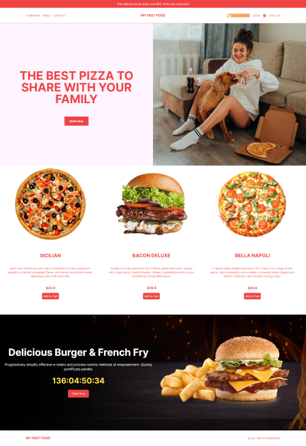
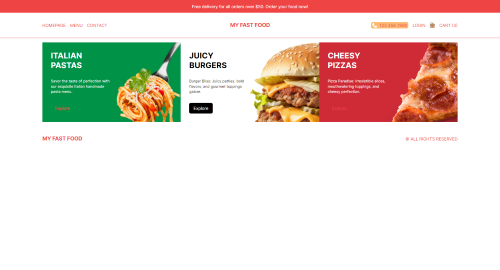
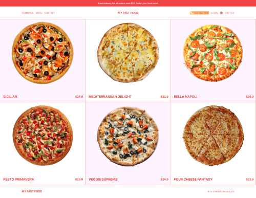
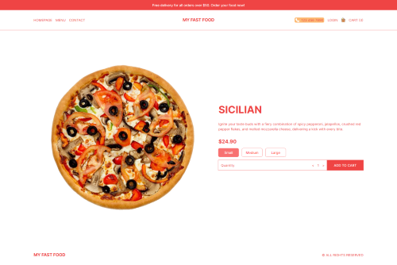
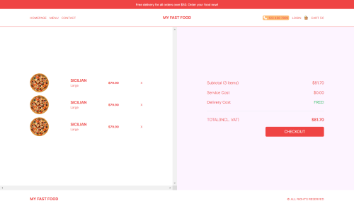
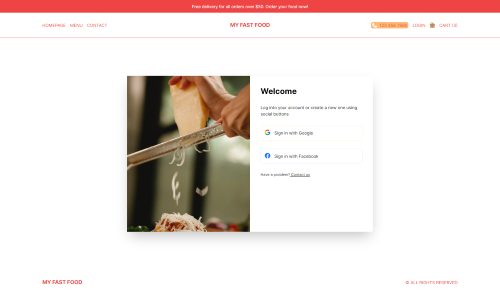
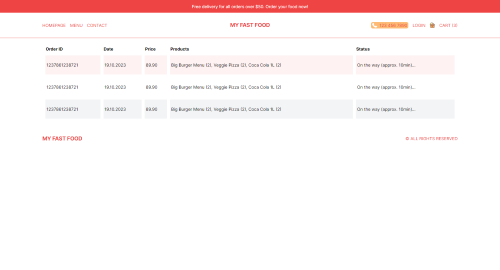

# My Fast Food

*Responsive application made with Next.Js and Tailwind for managing a fast food website.*

## Application Desing

### *Home page*

Home page of the application.

### *Categories page*

Categories page with options to choose.

### *Products page*

Products page with the list of products.

### *Single Product page*

Page of a single product.

### *Cart page*

Cart page showing all items in cart.

### *Login page*

Page for logging in.

### *Orgers page*

Page where you can see all of your orders.

## Commands

Run the application using command *npm run dev*.